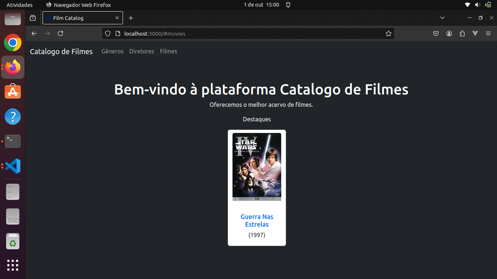

<h1>CATALOGO DE FILMES</h1>

<h2>Dependências</h2>

- Ruby 3.2.1
- Rails 7.2.1
- Node v20.12.2<small> (algumas atualizações podem ser necessárias)</small>
- Yarn 1.22.22<small> (algumas atualizações podem ser necessárias)</small>

<h2>Gems utilizadas</h2>
<ul>
  <li>Bootstrap</li>
  <li>Kaminari & kaminari-bootstrap</li>
  <li>database_cleaner-active_record</li>
  <li>Foreman</li>
  <li>image_processing</li>
</ul>

<h2>Inicialização do projeto</h2>

O projeto foi iniciliazado utilizando os parâmetros para o css com bootstrap e para javascript com esbuilding.

Dentro do diretório do projeto rode o comando `bundle install`.

Inicie o projeto com `bin/dev`.

<small>Certifique-se que os pacotes do Node e Yarn estão todos presentes, em caso de dúvidas consulte: <a href="https://nodejs.org/pt/learn/getting-started/introduction-to-nodejs">Saiba mais Node</a> e <a href="https://yarnpkg.com/getting-started">Saiba mais Yarn</a>.</small>

<h3>Tela inicial</h3>

Para a cadastro de um novo filme deve-se inicial cadastra um Gênero e, em seguida, um diretor.

Para o cadastro de um filme pode-se inserir uma imagem de capa, que uma vez cadastrada e autorizada, será exibida na tela inicial.

